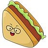
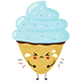

# Miau! Atrapame si puedes

## Equipo de desarrollo

- Micaela Cisilino
- Cynthia Abbate
- Ariel Alejandro Guerra

## Capturas

(agregar)

## Reglas de Juego / Instrucciones

El objetivo del juego es alimentar al gato sin que se intoxique ni explote!
El gato empieza con 15 puntos de vida y se mueve de izquierda a derecha con las flechas del teclado. 
La comida cae desde arriba de forma aleatoria y el gato debe atraparla.
Hay tres tipos de comida: 
- General ( +1 punto):  Hamburguesa -  Pizza -  Taco -  Papas -   Sándwiches -  Pollo
- Especial (+2 puntos) :  Whiskas -  Helado -  Sushi
- Dañina (-2 puntos):  Helado enojado -  Manzana podrida -  Veneno
  
 OJO! hay una bomba que cae más rápido que la comida y que le quita toda la vida al gato si la toca. 

Para ganar el juego, el gato debe tener 40 puntos o más.

Aclaración: el gato pierde cuando llega a 0 puntos o menos

## Otros

- Curso/Facultad
- Versión de wollok
- Una vez terminado, no tenemos problemas en que el repositorio sea público / queremos manternerlo privado
